# ✍️ BlogSpace

### Share Your Ideas With The World

A modern, responsive blogging platform designed for writers, engineers, and researchers to create, discover, and engage with meaningful content.

<div align="center">


</div>

---

## 📑 Table of Contents

- [About BlogSpace](#-about-blogspace)
- [✨ Key Features](#-key-features)
- [📸 Prototype Screenshots](#-prototype-screenshots)
- [🛠️ Tech Stack](#️-tech-stack)
- [📁 Project Architecture](#-project-architecture)
- [🚀 Installation & Setup](#-installation--setup)
- [💻 Build Commands](#-build-commands)
- [🔑 Demo Account](#-demo-account)
- [💾 Data Storage](#-data-storage)
- [🛣️ Future Roadmap](#️-future-roadmap)
- [🤝 Contributing](#-contributing)
- [📄 License](#-license)
- [👨‍💻 Author](#-author)

---

## 📖 About BlogSpace

**BlogSpace** is an editorial blogging platform designed for high-signal knowledge sharing. In an internet often cluttered with ads and generic AI summaries, BlogSpace provides a clean reading environment and an authoring studio.

Whether detailing complex software architectures, sharing lessons from scaling engineering teams, or publishing design systems insights, BlogSpace helps creators reach engaged readers through interactive features such as likes, bookmarks, responses, and author profiles.

---

## ✨ Key Features

### 🏠 Home Experience
- **Hero & Trust Metrics**: Overview with dynamic counters (*10K+ Readers*, *2K+ Stories*, *500+ Writers*).
- **Featured Articles Showcase**: 3-column responsive grid with reading times, category pills, and quick bookmarks.
- **Live Search & Category Filter**: Reactive search across titles, topics, and author names, combined with category pills (`Technology`, `AI`, `Programming`, `Design`, `Career`, `Lifestyle`).
- **Sorting Controls**: Sort by Newest, Most Popular (Views), Most Liked, Shortest Read, or Deep Dives.
- **Weekly Digest**: Newsletter subscription banner with instant feedback.

### 🔎 Explore & Topic Hub
- **Multi-Filter Sidebar**: Filter by category with live article counters.
- **Topic Tags**: Direct tag filtering (`#Artificial Intelligence`, `#React`, `#TypeScript`, `#System Design`, `#UI/UX`, `#Performance`, etc.).
- **Layout Switcher**: Toggle between Grid View and List View.
- **Active Filter Chips**: 1-click removal of active filters or full reset.

### ✍️ Creator Studio & Blog Editor
- **TipTap Rich Text Editor**: Heading levels (H1, H2, H3), bold, italic, underline, strikethrough, blockquotes, bullet and numbered lists, code blocks, link modal, and image embeds.
- **Cover Image Selector**: 6 Unsplash photo presets plus custom image URL input with live preview.
- **Live Reading Metrics**: Dynamic word count, character count, and calculated reading time.
- **Live Reader Preview Modal**: Full modal preview displaying the formatted article before publishing.
- **Draft & Publish Workflow**: Save stories as drafts or publish instantly.

### 📖 Reader Experience & Social Features
- **High-Readability Typography**: Editorial font hierarchy, styled blockquotes, code blocks, and cover imagery.
- **Author Following**: Interactive Follow/Unfollow simulation.
- **Floating Reader Action Bar**:
  - Heart like button with counter and persistence.
  - Bookmark / save to reading list.
  - Quick jump to responses.
  - Social share modal (X/Twitter, LinkedIn, Facebook, and 1-click clipboard link copy).
- **Interactive Responses**: Comment form with validation, user avatar, timestamps, reply simulation, and author deletion rights.
- **Related Stories**: Contextual recommendations based on matching category and topics.

### 📊 Creator Dashboard & Analytics
- **Summary Metrics**: 4 stat cards (Total Stories, Published, Drafts, Total Views).
- **Story Management Table**: View, edit, toggle publish/draft status, and delete with safety confirmation dialog.
- **Audience Analytics**: Average read rate, reader retention, and total engagement breakdown.

### 🔐 Authentication & Profile
- **Form Validation**: Email format validation, username checks, and real-time password strength meter.
- **1-Click Demo Login**: Pre-configured account (Alex Morgan, Staff Software Architect) for instant testing.
- **Profile Hub**: Tabs for Published Stories, Drafts, Reading List (Bookmarks), and Liked Stories with profile editing modal.
- **Settings**: Account info, notification preferences, and password change simulation.

### 📱 Responsive Design
- Optimized for mobile (375px+), tablet, and desktop (1440px+).
- Mobile navigation drawer with smooth animations and zero horizontal overflow.

---

## 📸 Prototype Screenshots

### 🏠 Home Page — Hero & Featured Stories
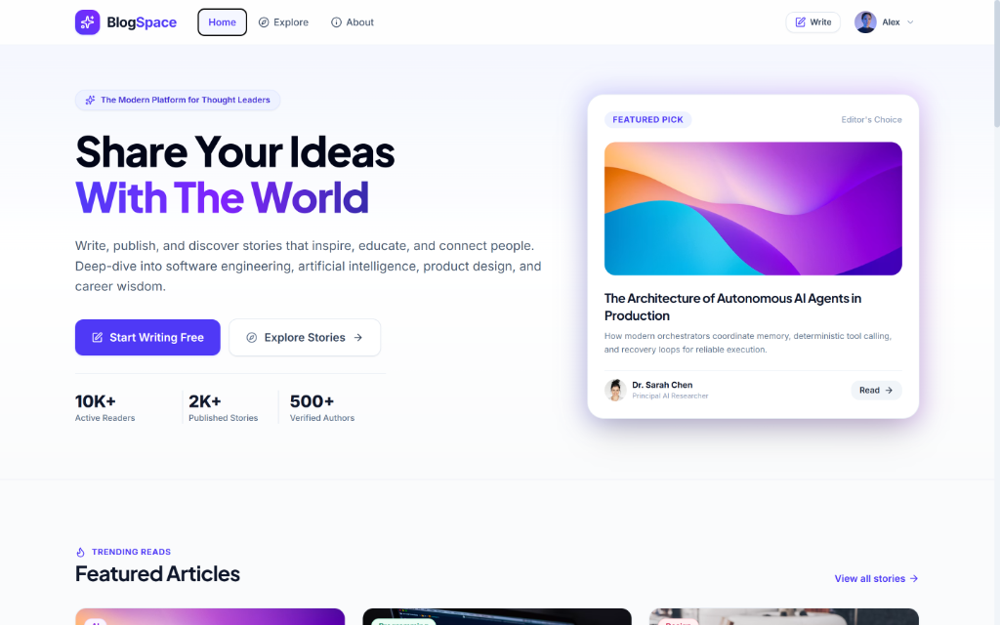

---

### 📰 Home Page — Live Discovery & Category Filters
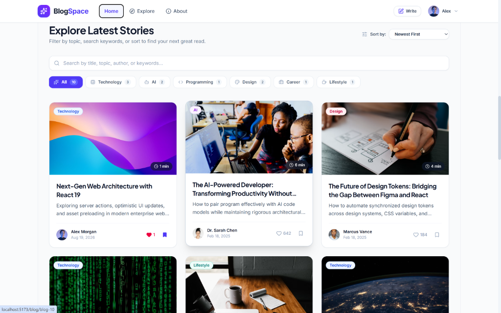

---

### 🔎 Explore Page — Topic Tags & Multi-Filter Search
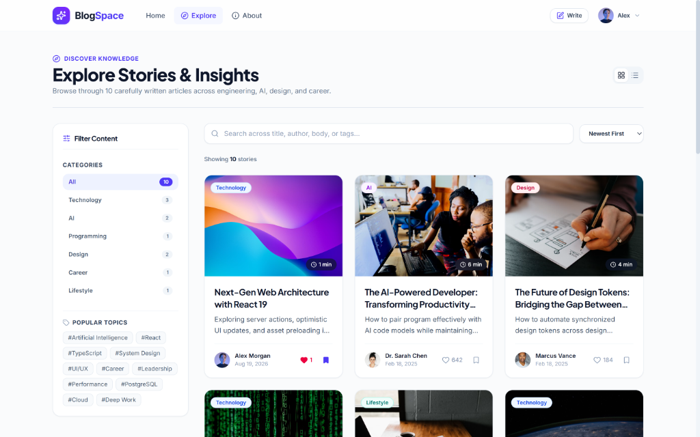

---

### ℹ️ About Page — Platform Mission & Community Metrics
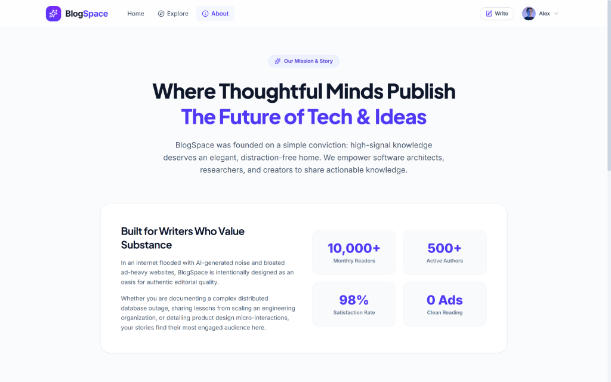

---

### 🔐 Authentication — Login Page
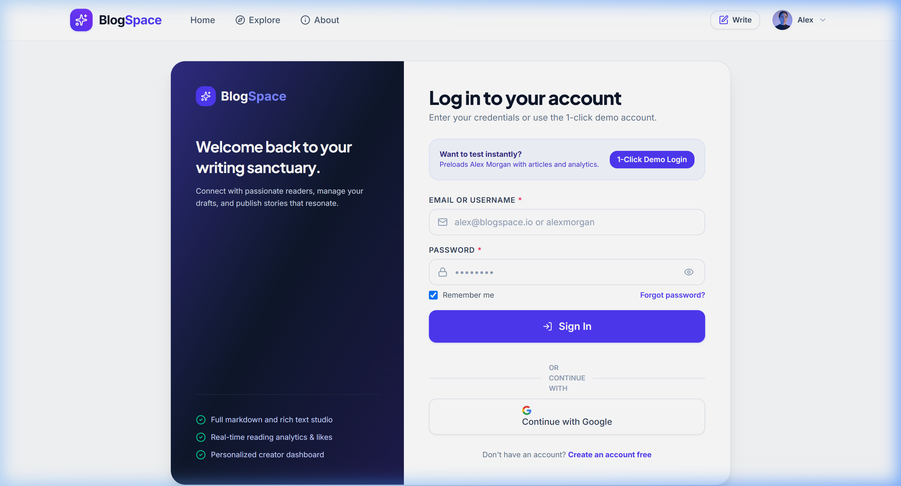

---

### 📝 Authentication — Registration & Password Strength Meter
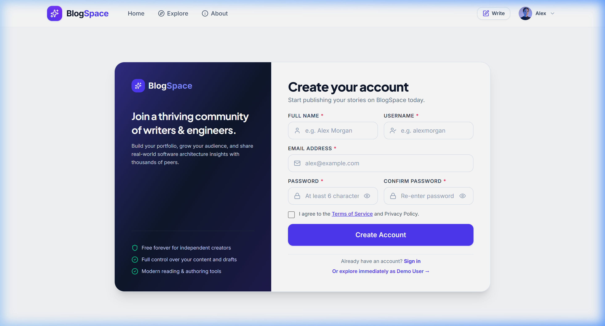

---

### 📊 Creator Dashboard — Statistics & Story Management
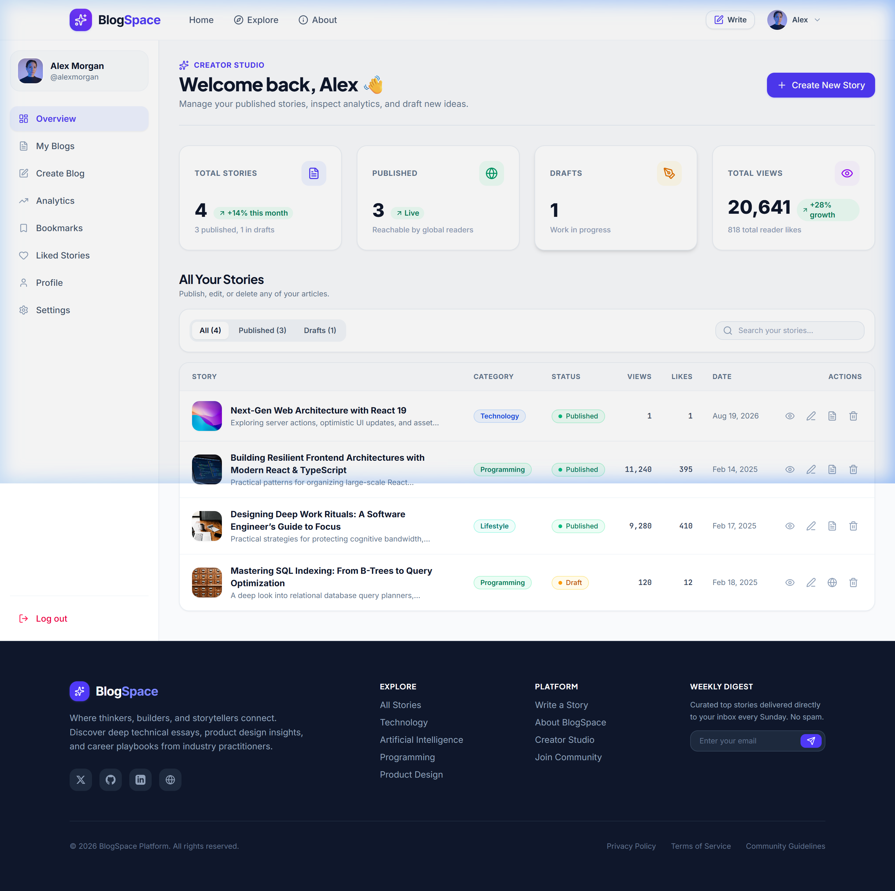

---

### ✍️ Creator Studio — TipTap Rich Text Editor & Live Preview
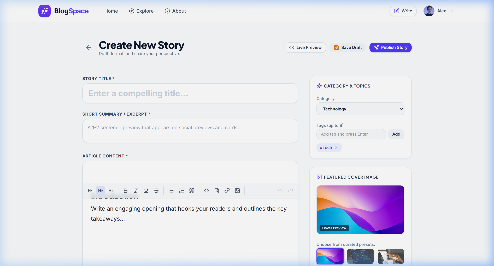

---

### 📖 Blog Reading Experience — Floating Actions & Social Bar
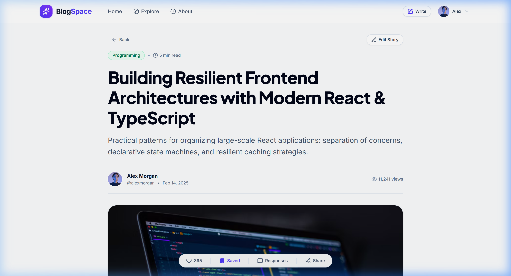

---

### 👤 Author Profile — Bio, Metrics & Reading List
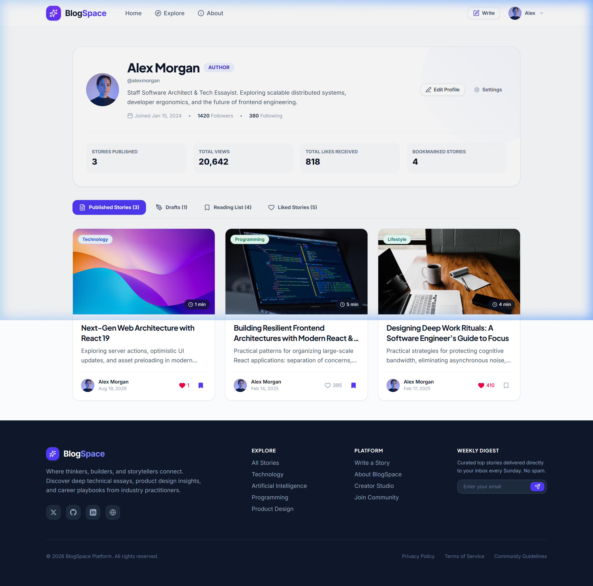

---

### ⚙️ Settings — Account & Notification Preferences
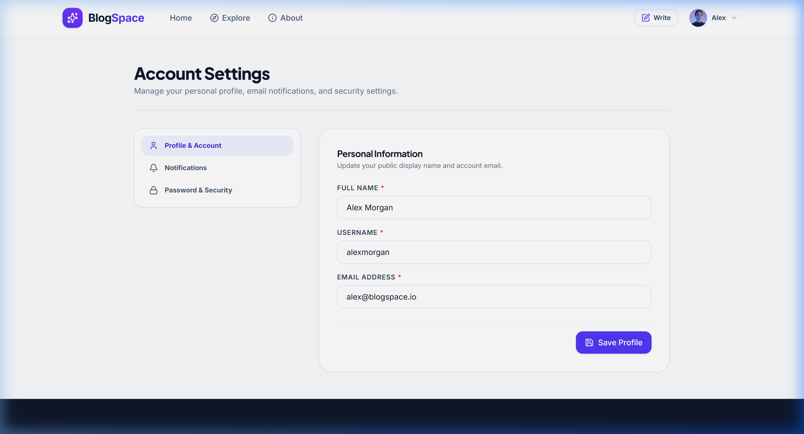

---

### 📱 Mobile Responsive View — Drawer Navigation
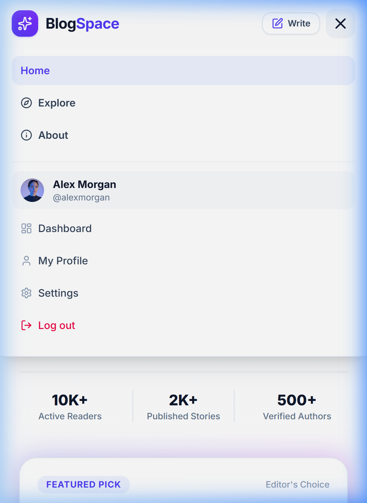

---

## 🛠️ Tech Stack

| Category | Technology |
| :--- | :--- |
| **Framework** | [React 19](https://react.dev/) + [TypeScript](https://www.typescriptlang.org/) |
| **Build Tool** | [Vite](https://vitejs.dev/) |
| **Styling** | [Tailwind CSS v4](https://tailwindcss.com/) |
| **Rich Text Editor** | [TipTap Editor Suite](https://tiptap.dev/) |
| **Icons** | [Lucide React](https://lucide.dev/) |
| **Routing** | [React Router DOM](https://reactrouter.com/) |
| **Sanitization** | [DOMPurify](https://github.com/cure53/DOMPurify) |
| **State & Persistence** | React Context API + LocalStorage Service Layer |

---

## 📁 Project Architecture

```text
src/
├── components/
│   ├── blog/          # BlogCard, BlogGrid, RichTextEditor, PreviewModal, CommentSection, ShareModal
│   ├── common/        # Avatar, Badge, Button, Input, Modal, Toast, LoadingSkeleton, EmptyState
│   ├── dashboard/     # StatsCard, MyBlogsTable, DeleteConfirmModal
│   └── layout/        # Navbar, Footer, DashboardSidebar
├── context/           # AuthContext, BlogContext, ToastContext
├── data/              # Realistic mock seed data (mockBlogs, mockUsers, mockComments)
├── hooks/             # Custom React hooks (useAuth, useBlogs, useToast)
├── pages/             # All 12 page views (Home, Explore, About, Detail, Studio, Dashboard, etc.)
├── services/          # Storage, Auth, Blog, Comment, Bookmark service layer
├── types/             # TypeScript type definitions and interfaces
├── utils/             # Reading time calculator, HTML sanitizer, slug generator, date formatters
├── App.tsx            # Main router configuration & layout wrappers
├── main.tsx           # Application entry point
└── index.css          # Tailwind CSS v4 styling, prose, and animations
```

---

## 🚀 Installation & Setup

### Prerequisites
- [Node.js](https://nodejs.org/) (version 18 or higher)
- npm or yarn

### Steps

1. Clone the repository:
   ```bash
   git clone https://github.com/adil9161/blogspace.git
   cd blogspace
   ```

2. Install dependencies:
   ```bash
   npm install
   ```

3. Start the local development server:
   ```bash
   npm run dev
   ```
   Open your browser at `http://localhost:5173/`.

---

## 💻 Build Commands

```bash
# Start local development server
npm run dev

# Run TypeScript type check
npx tsc --noEmit

# Build production bundle
npm run build

# Preview production build locally
npm run preview
```

---

## 🔑 Demo Account

For testing the creator studio and dashboard without manual sign-up:

- **1-Click Demo Button**: Click the **"1-Click Demo Login"** button on the `/login` page.
- **Demo User Profile**:
  - **Name**: Alex Morgan
  - **Email**: `alex@blogspace.io`
  - **Username**: `alexmorgan`
  - **Role**: Author / Staff Software Architect
  - Pre-populated with published articles, drafts, views, likes, and analytics.

---

## 💾 Data Storage

The current prototype uses browser `localStorage` for client-side persistence.

This includes:
- Active authentication session
- Blog stories & drafts
- Likes & view counts
- Bookmarks & reading lists
- Comments & responses
- User profile & preferences

This architecture is built with an abstracted service layer (`authService`, `blogService`, `commentService`, `bookmarkService`), making it straightforward to connect to a REST API or GraphQL backend in the future.

---

## 🛣️ Future Roadmap

- [ ] Node.js / Express or NestJS backend API
- [ ] PostgreSQL database with Prisma ORM
- [ ] JWT authentication with OAuth 2.0 (Google, GitHub)
- [ ] Cloud image upload storage (Cloudinary / AWS S3)
- [ ] Real-time notifications via WebSockets
- [ ] Markdown (.md) import and export
- [ ] AI-assisted story outline and drafting tools

---

## 🤝 Contributing

Contributions and suggestions are welcome!

1. Fork the repository
2. Create a feature branch (`git checkout -b feature/amazing-feature`)
3. Commit your changes (`git commit -m 'feat: add amazing feature'`)
4. Push to the branch (`git push origin feature/amazing-feature`)
5. Open a Pull Request

---

## 📄 License

This project is licensed under the Apache 2.0 License - see the [LICENSE](./LICENSE) file for details.

---

## 👨‍💻 Author

**Adil Quraishi**  
*B.Tech Computer Science & Engineering*

**Interests**:
- Software Engineering & Architecture
- Full-Stack Web Development
- Artificial Intelligence & Machine Learning
- Product Design & Developer Ergonomics
